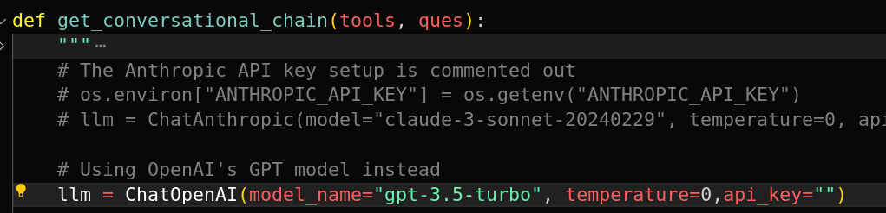
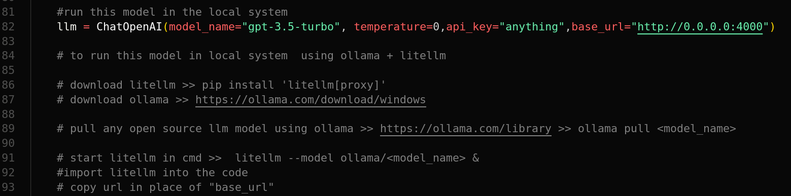
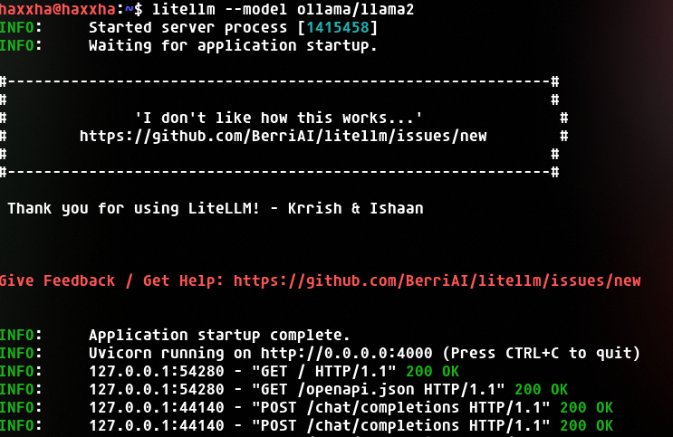

## PDF-Whisperer

PDF-Whisperer is an intelligent PDF reader powered by Large Language Models (LLMs) that allows you to read, analyze, and interact with PDF documents effortlessly. This tool can extract information, understand context, and provide summaries or answers to questions based on the content. It includes advanced capabilities such as entity recognition, contextual understanding, sentiment analysis, and interactive querying.

### Key Features
1. **Two Modes of Operation**:
   - **Cloud-based Processing**: Utilize OpenAI’s API for powerful, remote processing of PDF content.
   - **Local Processing**: Use Ollama and Litellm to run everything offline, ensuring data privacy and control.

2. **Flexible LLM Options**:
   - Leverage pre-trained LLMs, fine-tuned models, and ensemble methods to achieve a deep understanding of PDF content.
   - Choose between using your OpenAI API key or running models locally for greater flexibility in data handling and privacy.

### Target Audience
- **Researchers, professionals, and students** looking to streamline information extraction, boost productivity, and facilitate learning through an automated, intelligent PDF reader.

### Quick Start

1. **Install Dependencies**:

   ```bash
   pip install -r requirements.txt
   ```

2. **Run with OpenAI GPT Model**:

   Set up your OpenAI API key in the application settings.

   

   Start the application with Streamlit:

   ```bash
   streamlit run app.py &
   ```

3. **Run Locally with Ollama and Litellm**:

   Install [Ollama](https://ollama.com/download/) and follow the [Litellm Proxy Quick Start Guide](https://docs.litellm.ai/docs/proxy/quick_start#quick-start---litellm-proxy--configyaml).

   

   [Pull Ollama model](https://ollama.com/library)

   ```bash
   ollama pull <model_name>
   ```
   model used in litellm must be present in local system to check 
   ```bash
   ollama list
   ```

   Start the Litellm proxy:

   ```bash
   litellm --model ollama/<model_name> &
   ```
   

   The proxy will run on `http://0.0.0.0:4000`. Use this URL as the `base_url` instead of the OpenAI API key for local processing.
   

---

This streamlined version provides a concise overview of your project, focusing on key features, quick start instructions, and the benefits of using your tool.
